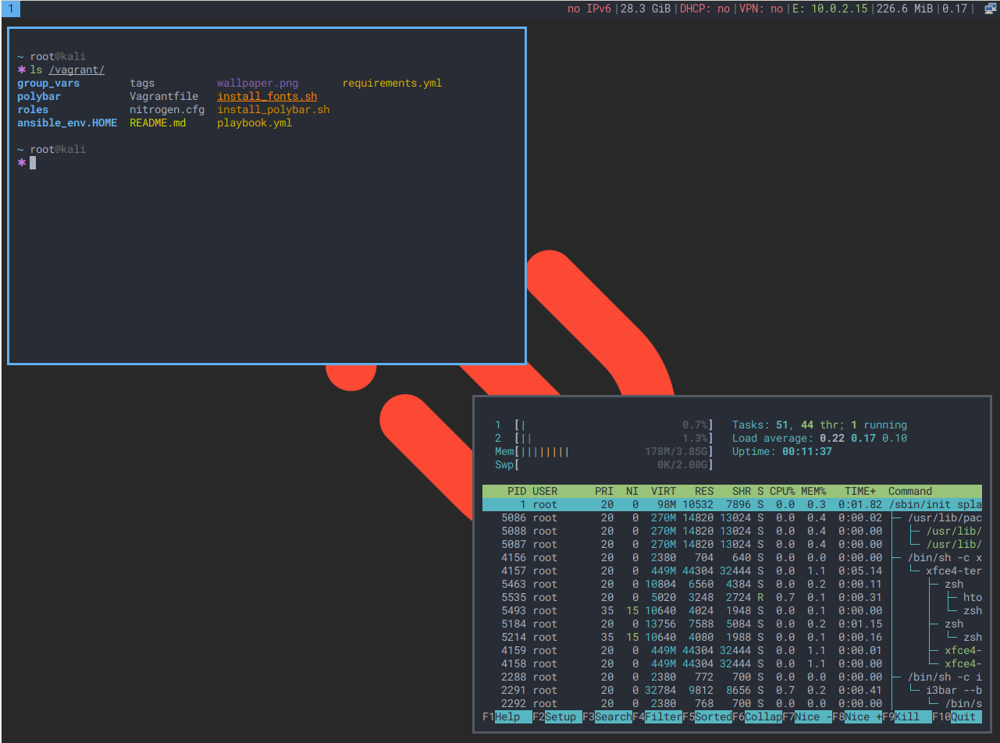

# [i3](https://i3wm.org/) Kali Linux Vagrant

Create a [Kali](https://www.kali.org/) virtual machine with the
[i3](https://i3wm.org) window manager using [vagrant](https://www.vagrantup.com)
and [ansible](https://www.ansible.com)



## Why?

I've got used to my i3-based desktop experience and didn't want to miss it when
using Kali VMs. Since setting everything up is tedious, I automated my setup.

## Disclaimer

While I tried to use sensible defualts in most places, this setup uses my
[personal dotfiles](https://github.com/binaryplease/dotfiles-ansible) and is
tailored to my taste. You might experience non-default behaviour and settings.

## Usage

While knowledge about Ansible and Vagrant might be helpful, the setup is pretty
straigt-forward (actually only one single command, if everything goes well)

#### Prerequisites

You will need to have [vagrant](https://www.vagrantup.com) installed on your
system. Ansible is **not** required, it will be automatically installed inside
the VM. With vagrant installed, just clone this repository.

#### Run

To generate and start the VM run just run vagrant inside the cloned repository
containing the `Vagrantfile`:

```bash
vagrant up
```

Vagrant will download all necessary files, create a new Virtual Machine and
configure everything as defined in the Ansible `playbook.yml`, this might take a
while on the first start.

#### Login

After vagrant has finished type in type in the default Kali credentials
(`root`/`toor`) and select `i3 session` in the top right menu of the login
manager.

#### Custom settings

There are a few settings that you might want to chang. These are defined at the
top of the `playbook.yml`

|Variable| Default | Description|
|---|---|---|
| i3_use_gaps| false | Use i3-gaps instead of i3|
| i3_terminal| xfce4-terminal | Terminal emulator lauched with `mod`+`enter`|
| i3_use_polybar| false| use polybar instead of i3bar|
| i3_keyboard_layout| 'us -variant colemak -option "caps:escape"'| keyboard layout|
| i3_optional| false| disable optional i3 settings|

In particular, I use the [colemak](https://colemak.com/) keyboard layout. If you
prefer something else, just put it in `i3_keyboard_layout` (e.g. `us`, without
the variant)

## Troubleshooting

Please report any issues not documented here.

#### First start

You might need to reboot the machine after the first provisioning has finished
to use all the settings made automatically.

#### i3 session not starting, even if selected

There is a strange behaviour of the login manager, causing it to launch the
default XFCE session instead of i3 sometimes, even if it was selected. To fix
this select the session **after** entering username and password, then click
login.

Once again:

1. Type user/pass
2. select "i3 session"
3. press login. (Order matters!)

#### Shell shows errors

While the `zsh` plugins should be installed automatically, this sometimes fails.
If this happens, run `vagrant provision` again manually, then install the
plugins with this command:

```bash
/root/.local/bin/antibody bundle < /root/.config/zsh/zsh_plugins > /root/.zsh_plugins.sh
```

## Documentation

There is also an accompanying post on my 
[personal blog](https://pablo.tools/posts/computers/custom-kali-box/)
with more information about this project and how it was created.
Some of the added comments in the code might also be helpful.

## Contributing

If you experience a bug or would like something changed or added, you are more
than welcome to open a issue or contribute a pull-request!
